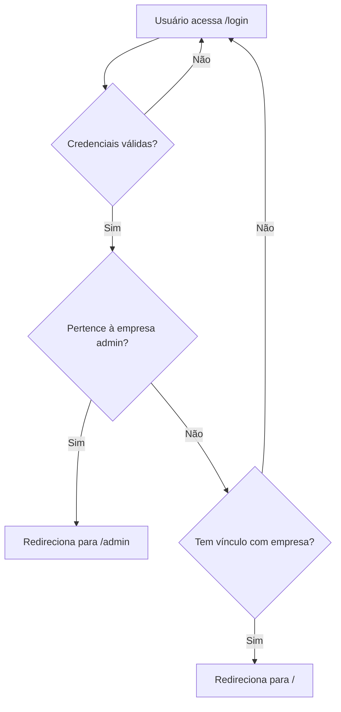

# Estrutura dos Painéis Filament

## Visão Geral

O sistema possui dois painéis Filament:
- **Painel Admin** (`/admin`): Acesso exclusivo para membros da empresa administradora
- **Painel User** (`/`): Acesso para todos os usuários cadastrados com vínculo a uma empresa

## Estrutura de Rotas

### Painel User (Padrão)
- **Path**: `/` (raiz)
- **ID**: `user`
- **Acesso**: Usuários com vínculo a qualquer empresa
- **Middleware**: `EnsureHasAnyCompany`

### Painel Admin
- **Path**: `/admin`
- **ID**: `admin`
- **Acesso**: Apenas membros da empresa admin (configurável via `ADMIN_COMPANY_SLUG`)
- **Middleware**: `EnsureAdminCompanyMember`

## Autenticação Unificada

O sistema usa uma tela de login unificada em `/login` que:
1. Valida credenciais do usuário
2. Verifica a empresa do usuário
3. Redireciona automaticamente:
   - `/admin` → Se o usuário pertence à empresa admin
   - `/` → Se o usuário pertence a qualquer outra empresa

## Organização de Arquivos

### Estrutura de Pastas
```
app/Filament/
├── Admin/                       # Painel Administrativo
│   ├── Pages/
│   │   └── Dashboard.php
│   ├── Resources/
│   └── Widgets/
│       └── StatsOverviewWidget.php
│
└── User/                        # Painel de Usuários
    ├── Pages/
    │   └── Dashboard.php
    ├── Resources/
    └── Widgets/
        └── WelcomeWidget.php
```

### Views dos Dashboards
```
resources/views/filament/
├── admin/
│   └── pages/
│       └── dashboard.blade.php
│
└── user/
    ├── pages/
    │   └── dashboard.blade.php
    └── widgets/
        └── welcome-widget.blade.php
```

**Nota**: Toda a estrutura está organizada por painel (Admin/User) para melhor visualização e manutenção do código.

## Middlewares

### EnsureAdminCompanyMember
- Verifica se o usuário pertence à empresa admin (via slug configurado)
- Redireciona para `/` se não for membro
- Aplicado ao painel admin

### EnsureHasAnyCompany
- Verifica se o usuário tem vínculo com alguma empresa
- Redireciona para `/login` se não tiver
- Aplicado ao painel user

## Configuração

### Variáveis de Ambiente

```env
# Empresa administradora
ADMIN_COMPANY_SLUG=acme

# Seed automático (migration)
ADMIN_SEED=true

# Admin user inicial
ADMIN_NAME="Admin"
ADMIN_EMAIL=admin@example.com
ADMIN_PASSWORD=password
ADMIN_TIMEZONE=UTC
ADMIN_LOCALE=en

# Company admin inicial
ADMIN_COMPANY_NAME="Acme Inc"
ADMIN_COMPANY_CURRENCY=USD

# Role admin e permissões
ADMIN_ROLE_KEY=ceo
ADMIN_GRANT_ALL_PERMISSIONS=true
```

## Fluxo de Acesso



## Customização dos Dashboards

### Admin Dashboard
Localização: `app/Filament/Admin/Pages/Dashboard.php`

```php
protected function getHeaderWidgets(): array
{
    return [
        \App\Filament\Admin\Widgets\StatsOverviewWidget::class,
        // Adicione mais widgets aqui
    ];
}
```

### User Dashboard
Localização: `app/Filament/User/Pages/Dashboard.php`

```php
protected function getHeaderWidgets(): array
{
    return [
        \App\Filament\User\Widgets\WelcomeWidget::class,
        // Adicione mais widgets aqui
    ];
}
```

## Criando Novos Resources

### Para o Painel Admin
```bash
php artisan make:filament-resource Company --panel=admin
```

### Para o Painel User
```bash
php artisan make:filament-resource Project --panel=user
```

## Sistema de Permissões (RBAC)

O sistema utiliza traits customizadas para gerenciar roles e permissions:
- `HasCompanyRoles` → Para `CompanyUser`
- `RoleMethods` → Para `Role`
- `PermissionMethods` → Para `Permission`

### Verificando Permissões

```php
// Verificar se usuário tem role
$companyUser->hasRole('ceo');

// Verificar se usuário tem permissão
$companyUser->can('manage_projects');

// Atribuir role
$companyUser->assignRole('manager');

// Remover role
$companyUser->removeRole('developer');
```

## Testes

Execute os testes de autenticação e redirecionamento:

```bash
php artisan test --filter=UnifiedAuthRedirectTest
```

Execute os testes de RBAC:

```bash
php artisan test --filter=RbacAssignTest
php artisan test --filter=InitialRbacSeedTest
```

## Troubleshooting

### Erro 419 (CSRF Token Mismatch) no Login

Se você receber erro 419 ao tentar fazer login:

1. **Limpar caches**:
   ```bash
   php artisan route:clear
   php artisan config:clear
   php artisan view:clear
   php artisan cache:clear
   ```

2. **Verificar sessão**: Certifique-se de que as sessões estão configuradas corretamente em `config/session.php`

3. **Verificar .env**: Confirme que `APP_URL` está correto no arquivo `.env`

4. **Verificar cookies**: Se estiver rodando em ambiente local com domínios diferentes, ajuste:
   ```env
   SESSION_DOMAIN=localhost
   SESSION_SECURE_COOKIE=false
   ```

### Erro ao Acessar Dashboards

Se você não consegue acessar os dashboards após login:

1. **Verificar empresa admin**: Confirme que o slug da empresa no `.env` está correto:
   ```env
   ADMIN_COMPANY_SLUG=acme
   ```

2. **Verificar vínculo do usuário**: O usuário deve estar vinculado a uma empresa através da tabela `company_user`

3. **Limpar cache de permissões**:
   ```bash
   php artisan cache:forget spatie.permission.cache
   ```

### Widgets Não Aparecem

Se os widgets não estão sendo exibidos no dashboard:

1. **Verificar namespace**: Certifique-se de que os widgets estão nos namespaces corretos:
   - Admin: `App\Filament\Admin\Widgets`
   - User: `App\Filament\User\Widgets`

2. **Limpar views compiladas**:
   ```bash
   php artisan view:clear
   ```

### Comandos Úteis

```bash
# Limpar todos os caches
php artisan optimize:clear

# Recriar banco de dados com seeds
php artisan migrate:fresh --seed

# Ver todas as rotas
php artisan route:list

# Verificar configuração atual
php artisan config:show

# Rodar servidor de desenvolvimento
php artisan serve
```


